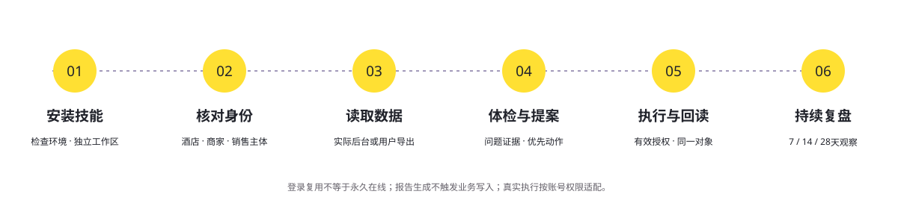

# OpenLX 飞猪酒店运营助手

**让每一间好房，被认真经营。** 从供货价、日历房到套餐预约与结算，把信息变成可执行、可复查的经营动作。

[产品官网](https://feizhu.openlx.cn) · [完整报告示例](https://feizhu.openlx.cn/reports) · [安装包与版本](https://github.com/openlxcn/openlx-fliggy-hotel-ops/releases) · [会员中心](https://feizhu.openlx.cn/account)

[多平台安装与发布状态](docs/PLATFORM-PUBLISHING.md) · [魔搭公开技能](https://modelscope.cn/skills/openlx/openlx-fliggy-hotel-ops)


v0.1.0 提供可安装技能、导入体检、离线HTML报告、飞猪专用规则、账号适配执行器与官网会员服务。**真实飞猪商家账号的读取、改价和点评发布尚待现场核验**；当前价格是框架建议，商业收款未开放。详见[分项状态](skills/openlx-fliggy-hotel-ops/references/status.json)。

## 为飞猪经营做的关键适配

- **改对价格**：供货价与客人零售价分别识别，锁定销售主体、房型、价格计划、日期和入住条件。PMS主控与旧值变化会阻止错误覆盖。
- **看见套餐后续责任**：100份两晚套餐、40份已预约，分别记录80个预约房晚和120个待预约权益房晚；部分退款按权益更新。
- **算真实贡献**：实际净结算不重复扣佣金与优惠；信用住有效订单不因未预付被排除。
- **给完整答案**：免费报告保留全部问题、证据与动作建议，数据缺失明确显示UNKNOWN；付费去推广署名。
- **同一个OpenLX账号**：注册验证、SMTP与已有账号服务复用；单品权益和未来通票分别管理。

## 十二项能力

官网、技能和文档采用同一[能力目录](skills/openlx-fliggy-hotel-ops/references/catalog.json)。下面是产品功能目标；依赖真实后台的执行需要当前账号映射。

| 编号 | 能力 | 具体工作 |
|---|---|---|
| ADV-01 | 专属Chrome，持续复用登录状态 | 独立配置、登录状态复用、酒店/店铺身份核对、人工接管、失效续登。 |
| ADV-02 | 全店经营体检，问题分轻重 | 检查资料、可售性、价态、订单、套餐、活动、点评和可获取的经营数据，提供证据和优先动作。 |
| ADV-03 | 酒店匹配、资料与图片优化 | 检查名称地址、酒店及房型匹配、设施政策、图片和真实卖点；避免重复建店和错误房型。 |
| ADV-04 | 多价格计划与套餐算账 | 分开管理含早/不含早、退改、连住、会员等实际价格计划，以及套餐权益与结算成本。 |
| ADV-05 | 日历房与预约套餐的库存管理 | 区分日期库存、套餐可售份额、已预约承诺、待预约权益；可靠库存支持下落实授权调整。 |
| ADV-06 | 有底线、可解释的自动调价 | 区分供货底价与零售价，标准版基础规则，至尊版多因素策略，执行前重读、执行后核验。 |
| ADV-07 | 可比同行与同酒店销售报价观察 | 同条件比较竞品；可识别时区分自有与其他销售主体报价，不能越权改动别人的报价。 |
| ADV-08 | 节日、需求与活动机会预警 | 真实事件、报名资格、时间和成本核对；不是见活动就报名。 |
| ADV-09 | 订单接待、预约与结算核对 | 区分预订、预约、入住、退房、退款和结算；生成可执行任务，核验信用住等已开通业务。 |
| ADV-10 | 好评自动回复，差评确认发布 | 免费自动发布真实正向评价的商家回复；差评/混合评价待确认，保留事实核验与整改追踪。 |
| ADV-11 | 店铺转化、素材与会员活动优化 | 素材文件夹到真实商品展示、咨询FAQ、套餐与已开通会员/活动经营；内容入口按权限核验。 |
| ADV-12 | HTML报告与持续经营复盘 | 问题、证据、动作、状态、收益与履约结果、历史对比、下一步任务。 |

## 操作流程



免费主线可直接用用户导出的经营数据运行，不依赖其他OpenLX技能。首次登录、字段核验完成后，逐项接入实际商家后台。

```sh
# 进入解压后的 openlx-fliggy-hotel-ops 技能目录
node scripts/install.mjs install
node scripts/ops.mjs doctor
node scripts/ops.mjs init --workspace /path/to/hotel-work --hotel hotel-id --name 酒店名称
node scripts/ops.mjs import --workspace /path/to/hotel-work --file /path/to/snapshot.json
node scripts/ops.mjs report --workspace /path/to/hotel-work
```

Node.js最低22.20；浏览器操作使用独立Chrome Profile。安装脚本支持升级、备份回退与可恢复卸载。运行参数与数据结构见[技能说明](skills/openlx-fliggy-hotel-ops/SKILL.md)和[运行文档](skills/openlx-fliggy-hotel-ops/references/runtime.md)。本地设备关机或休眠期间不会持续巡检。

## 免费与收费

只有免费与收费两类，无试用、优惠或兑换券。免费版长期可用；收费包含标准与至尊，当前价格是附件建议，尚待确认，购买入口关闭。

| 方案 | 月付 | 季付（3个月） | 年付 | 重点 |
|---|---:|---:|---:|---|
| 免费版 | ¥0 | ¥0 | ¥0 | 完整体检、HTML报告、点评和基础经营诊断 |
| 标准版（建议） | ¥14.9 | ¥29.9 | ¥79.9 | 基础自动调价、重点日期、日报周报与去推广署名 |
| 至尊版（建议） | ¥49.9 | ¥99.9 | ¥299.9 | 多因素策略、套餐结算专项、店铺素材与有限人工服务 |

单店授权，默认不自动续费。云端托管、模型调用、外部数据与广告费用不默认包含。平台账号权限不因购买软件而自动获得。已付费权益、服务工单与实际履约分别留证。

## 共用会员与未来通票

用户身份来自wx.openlx.cn，各产品不复制密码、SMTP密钥或支付私钥。当前是共用账号凭据，各站独立登录。

通票按季度/年度设计，可覆盖全部指定技能或部分技能组合。中央签名绑定用户、物业、明确产品清单、每产品级别、购买合同版本和有效期；新技能不静默扩大旧通票。**通票尚未开售**。飞猪已实现签名消费与范围校验，中央签发与商品系统后续统一接入，见[会员合同](docs/MEMBERSHIP.md)。

携程、美团、飞猪共用组件但独立进行平台适配，不串账号、不复用平台浏览器会话。数据同步约定见[系列协作说明](docs/SERIES.md)。

## 验证与开发

```sh
npm ci
npm test
npm run build
npm start
```

本地服务默认监听127.0.0.1:1989，生产由独立systemd服务运行。配置见.env.example；共享支付模块仅在服务器引用现有配置。安装包排除私钥、登录资料与商家数据。测试夹具的支付、LIVE字段和酒店均不构成真实平台验收。

[验证说明](docs/ACCEPTANCE.md) · [部署说明](docs/DEPLOYMENT.md) · [视觉来源](docs/VISUALS.md) · [官方资料](skills/openlx-fliggy-hotel-ops/references/sources.md)

## 联系我们

| OpenLX服务群 | 技术负责人 |
|---|---|
|  |  |

二维码与wx.openlx.cn保持一致。OpenLX / 法匠科技。独立第三方经营工具，未宣称飞猪官方合作或保证业绩。
